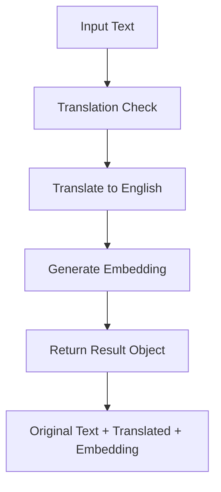

# AI Features Documentation

This document provides comprehensive details about the AI-powered features in Doy-Pal, including embeddings, similarity search, and multilingual support.

## Overview

Doy-Pal integrates advanced AI capabilities to provide intelligent event analysis, cross-language support, and automated categorization. The system uses OpenAI's latest embedding models to create semantic understanding of behavioral events.

## Core AI Components

### 1. Text Translation Pipeline

**Purpose**: Normalize all event descriptions to English for consistent embedding generation and comparison.

**Implementation**:

- **Model**: GPT-4 (`gpt-4o`)
- **Endpoint**: `/v1/chat/completions`
- **Process**:
  1. Detect if input text is already in English
  2. If not English, translate while preserving meaning, tone, and style
  3. Return unchanged text if already in English
  4. Use low temperature (0.3) for consistent translations

**Code Location**: `app/utils/embeddings.ts` - `translateToEnglish()`

### 2. Vector Embeddings

**Purpose**: Convert text descriptions into high-dimensional vectors for semantic similarity comparison.

**Implementation**:

- **Model**: `text-embedding-3-large`
- **Dimensions**: 1536
- **Endpoint**: `/v1/embeddings`
- **Features**:
  - High-quality multilingual support
  - Semantic understanding of behavioral contexts
  - Optimized for similarity search

**Code Location**: `app/utils/embeddings.ts` - `generateEmbedding()`

### 3. Combined Translation + Embedding

**Main Function**: `translateAndGenerateEmbedding()`

**Workflow**:



**Return Type**:

```typescript
type TranslationEmbeddingResult = {
  originalText: string;
  translatedText: string;
  embedding: number[];
};
```

## API Endpoints

### 1. Similarity Search API

**Endpoint**: `POST /api/admin/events/similar`

**Purpose**: Find events similar to input text using vector similarity.

**Request Body**:

```json
{
  "text": "cleaned the room",
  "threshold": 0.6,
  "limit": 10
}
```

**Response**:

```json
{
  "query": {
    "original": "cleaned the room",
    "translated": "cleaned the room"
  },
  "similarEvents": [
    {
      "id": "uuid",
      "description": "tidied up bedroom",
      "points": 3,
      "similarity": 0.85,
      "timestamp": "2024-01-15T10:30:00Z"
    }
  ]
}
```

**Features**:

- Cross-language search capability
- Configurable similarity threshold (default: 0.6)
- Adjustable result limit
- Real-time similarity calculation

### 2. Bulk Embedding Update API

**Endpoint**: `POST /api/admin/events/update-all-embeddings`

**Purpose**: Generate embeddings for all events that don't have them or need updates.

**Process**:

1. Find events missing embeddings or normalized descriptions
2. Process in batches of 3 events (rate limiting)
3. For each event:
   - Translate description to English
   - Generate embedding vector
   - Update database with both values
4. 2-second delay between batches

**Response**:

```json
{
  "message": "Events updated with translations and embeddings successfully",
  "updated": 15,
  "total": 20
}
```

### 3. Event Categorization API

**Endpoint**: `GET /api/admin/events/categories`

**Purpose**: Automatically group events into categories based on similarity.

**Query Parameters**:

- `threshold`: Similarity threshold for grouping (default: 0.8)

**Response**:

```json
{
  "categories": [
    {
      "category_id": 1,
      "sample_description": "helped with meal preparation",
      "event_count": 5
    }
  ],
  "threshold": 0.8
}
```

## Database Integration

### Vector Storage

**Table**: `events`
**Column**: `description_embedding vector(1536)`

**Index**:

```sql
CREATE INDEX events_description_embedding_idx
ON events USING ivfflat (description_embedding vector_cosine_ops)
WITH (lists = 100);
```

### Similarity Functions

**Function**: `find_similar_events()`

```sql
CREATE OR REPLACE FUNCTION find_similar_events(
  search_embedding vector(1536),
  similarity_threshold float,
  max_results int
)
RETURNS TABLE (
  id uuid,
  description text,
  points int,
  timestamp timestamptz,
  similarity float
)
```

**Similarity Calculation**: Cosine similarity using `<=>` operator

- `1 - (embedding1 <=> embedding2)` = similarity score
- Values closer to 1.0 indicate higher similarity

### Categorization Function

**Function**: `categorize_events()`

- Groups events by similarity threshold
- Creates temporary categories
- Returns representative samples and counts
- Processes only active events

## Performance Considerations

### Rate Limiting

- **Translation API**: 3 requests per batch with 2-second delays
- **Embedding API**: 3 requests per batch with 2-second delays
- **Total delay**: ~2-3 seconds between processing batches

### Batch Processing

- Process events in batches of 3
- Parallel processing within batches
- Sequential processing between batches
- Error handling for individual event failures

### Vector Search Optimization

- Uses `ivfflat` index for approximate nearest neighbor search
- Configurable list parameter (currently 100)
- Cosine distance operator for semantic similarity
- Index automatically maintained by PostgreSQL

## Error Handling

### Translation Errors

- Graceful fallback to original text if translation fails
- Detailed error logging with context
- API error passthrough for debugging

### Embedding Errors

- Empty array return for empty/invalid text
- API error details logged and returned
- Batch processing continues on individual failures

### Database Errors

- Transaction rollback on embedding update failures
- Detailed error logging for debugging
- Graceful handling of missing data

## Similarity Thresholds

### Recommended Values

- **High Precision**: 0.8-0.9 (very similar events only)
- **Balanced**: 0.6-0.8 (moderate similarity)
- **High Recall**: 0.4-0.6 (broader matching)
- **Cross-language**: 0.6+ (accounts for translation variations)

### Use Cases

- **Event Deduplication**: 0.85+
- **Related Events**: 0.6-0.8
- **Category Assignment**: 0.7-0.8
- **Search Suggestions**: 0.5-0.7

## Multilingual Support

### Supported Languages

- All languages supported by GPT-4
- Automatic language detection
- Consistent English normalization
- Preservation of cultural context

### Translation Quality

- Context-aware translations
- Behavioral event terminology understanding
- Consistent terminology across translations
- Low temperature for reproducible results

---

_This AI features documentation covers the current implementation as of the latest updates to the similarity search and embedding systems._
