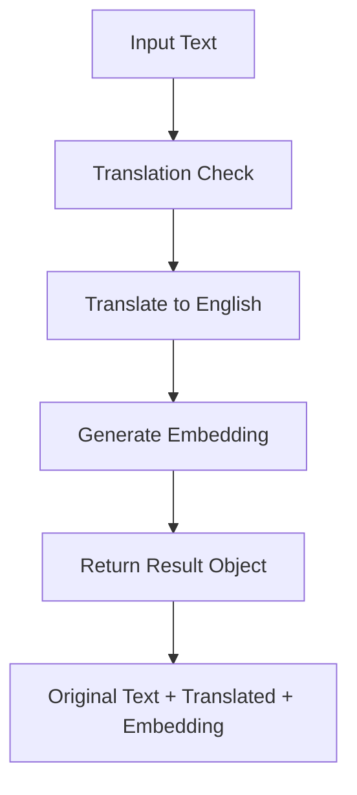

# AI Features Documentation

This document provides comprehensive details about the AI-powered features in Doy-Pal, including embeddings, similarity search, multilingual support, and the intelligent template system.

## Overview

Doy-Pal integrates advanced AI capabilities to provide intelligent event analysis, cross-language support, automated categorization, and smart template generation. The system uses OpenAI's latest models to create semantic understanding of behavioral events and generate reusable templates from usage patterns.

## Core AI Components

### 1. Text Translation Pipeline

**Purpose**: Normalize all event descriptions to English for consistent embedding generation and comparison.

**Implementation**:

- **Model**: GPT-4 (`gpt-4o`)
- **Endpoint**: `/v1/chat/completions`
- **Process**:
  1. Detect if input text is already in English
  2. If not English, translate while preserving meaning, tone, and style
  3. Return unchanged text if already in English
  4. Use low temperature (0.3) for consistent translations

**Code Location**: `app/utils/embeddings.ts` - `translateToEnglish()`

### 2. Vector Embeddings

**Purpose**: Convert text descriptions into high-dimensional vectors for semantic similarity comparison.

**Implementation**:

- **Model**: `text-embedding-3-large`
- **Dimensions**: 1536
- **Endpoint**: `/v1/embeddings`
- **Features**:
  - High-quality multilingual support
  - Semantic understanding of behavioral contexts
  - Optimized for similarity search

**Code Location**: `app/utils/embeddings.ts` - `generateEmbedding()`

### 3. Combined Translation + Embedding

**Main Function**: `translateAndGenerateEmbedding()`

**Workflow**:



**Return Type**:

```typescript
type TranslationEmbeddingResult = {
  originalText: string;
  translatedText: string;
  embedding: number[];
};
```

### 4. AI Template Generation

**Purpose**: Analyze behavioral patterns and generate reusable templates automatically.

**Implementation**:

- **Model**: GPT-4 (`gpt-4`)
- **Process**:
  1. Analyze latest 100 events using normalized descriptions
  2. Identify common behavioral patterns
  3. Generate 5-15 meaningful templates with confidence scores
  4. Version control with batch tracking
  5. Automatic template usage analytics

**Code Location**: `app/api/admin/analyze-templates/route.ts`

## API Endpoints

### 1. Similarity Search API

**Endpoint**: `POST /api/admin/events/similar`

**Purpose**: Find events similar to input text using vector similarity.

**Request Body**:

```json
{
  "text": "cleaned the room",
  "threshold": 0.6,
  "limit": 10
}
```

**Response**:

```json
{
  "query": {
    "original": "cleaned the room",
    "translated": "cleaned the room"
  },
  "similarEvents": [
    {
      "id": "uuid",
      "description": "tidied up bedroom",
      "points": 3,
      "similarity": 0.85,
      "timestamp": "2024-01-15T10:30:00Z"
    }
  ]
}
```

### 2. Template Analysis API

**Endpoint**: `POST /api/admin/analyze-templates`

**Purpose**: Analyze behavioral patterns and generate AI-powered templates.

**Process**:

1. Fetch latest 100 active events with normalized descriptions
2. Send to OpenAI GPT-4 for pattern analysis
3. Generate 5-15 meaningful templates with confidence scores
4. Deactivate old templates (version control)
5. Insert new templates with batch tracking

**Response**:

```json
{
  "success": true,
  "batch_id": "uuid",
  "analyzed_events": 87,
  "templates_generated": 12,
  "message": "Successfully analyzed 87 events and generated 12 templates"
}
```

### 3. Bulk Embedding Update API

**Endpoint**: `POST /api/admin/events/update-all-embeddings`

**Purpose**: Generate embeddings for all events that don't have them or need updates.

**Process**:

1. Find events missing embeddings or normalized descriptions
2. Process in batches of 3 events (rate limiting)
3. For each event:
   - Translate description to English
   - Generate embedding vector
   - Update database with both values
4. 2-second delay between batches

**Response**:

```json
{
  "message": "Events updated with translations and embeddings successfully",
  "updated": 15,
  "total": 20
}
```

### 4. Event Categorization API

**Endpoint**: `GET /api/admin/events/categories`

**Purpose**: Automatically group events into categories based on similarity.

**Query Parameters**:

- `threshold`: Similarity threshold for grouping (default: 0.8)

**Response**:

```json
{
  "categories": [
    {
      "category_id": 1,
      "sample_description": "helped with meal preparation",
      "event_count": 5
    }
  ],
  "threshold": 0.8
}
```

## Admin Interface Integration

### Template Management Dashboard

**Location**: `/admin/templates`

**Features**:

- **"Analyze Latest Events"** button for AI template generation
- Template management table with:
  - Name and description
  - Point values and usage frequency
  - AI confidence scores with color coding:
    - 🟢 Green: 80%+ (high confidence)
    - 🟡 Yellow: 60-79% (medium confidence)
    - 🔴 Red: <60% (low confidence)
  - Last usage dates
  - Activate/deactivate controls
- Real-time analysis progress and results
- Batch tracking for version control

### Embeddings Management Dashboard

**Location**: `/admin/embeddings`

**Features**:

- Similarity search testing interface
- Event categorization viewer
- Bulk embedding processing
- Cross-language search capabilities
- Performance monitoring

## Template System Integration

### Event Creation Flow

```typescript
// When user selects template during event creation:
1. Template auto-fills form fields (name, description, points)
2. User can modify any field before submission
3. Event is created with template_id reference
4. AI processing generates embedding and translation
5. Template usage statistics are updated automatically
```

### Template Usage Analytics

**Tracking Metrics**:

- `frequency`: Usage count incremented on each use
- `last_seen`: Updated timestamp on template usage
- `ai_confidence`: AI-generated confidence score (0.0-1.0)
- `generation_batch`: Version control for template generations

## Database Integration

### Vector Storage

**Table**: `events`
**Columns**:

- `description_embedding`: vector(1536) - semantic similarity search
- `normalized_description`: text - English translation for consistency
- `template_id`: uuid - reference to template used (if any)

**Indexes**:

```sql
-- Vector similarity search
CREATE INDEX events_description_embedding_idx
ON events USING ivfflat (description_embedding vector_cosine_ops)
WITH (lists = 100);

-- Template relationships
CREATE INDEX idx_events_template ON events (template_id);
```

### Template Storage

**Table**: `templates`
**Key Fields**:

- `name`: AI-generated template name
- `description`: Standardized description
- `default_points`: Suggested point value
- `frequency`: Usage count for popularity ranking
- `ai_confidence`: AI confidence score (0.0-1.0)
- `generation_batch`: Version control tracking

### Analysis Tracking

**Table**: `template_analysis`
**Purpose**: Track AI analysis history and metadata
**Fields**:

- `batch_id`: Links to template generation batch
- `analyzed_events_count`: Number of events analyzed
- `ai_model_used`: OpenAI model version
- `ai_response_raw`: Full AI response for debugging
- `templates_generated`: Number of templates created

## Performance Considerations

### Rate Limiting

**Translation & Embedding**:

- 3 requests per batch with 2-second delays
- Automatic retry with exponential backoff
- Graceful degradation if AI services fail

**Template Analysis**:

- Manual triggering only (cost control)
- Batch processing of 100 events
- Analysis results cached in database

### Cost Optimization

**Strategies**:

- Use normalized descriptions for consistency
- Batch processing to reduce API calls
- Manual template analysis triggering
- Smart caching of AI results
- Efficient similarity thresholds

## Error Handling

### AI Service Failures

**Translation Errors**:

- Graceful fallback to original text
- Detailed error logging with context
- Event creation continues without AI features

**Embedding Errors**:

- Empty array return for invalid input
- Batch processing continues on individual failures
- Comprehensive error logging

**Template Analysis Errors**:

- Detailed error messages for admins
- Rollback capability for failed analyses
- Metadata preservation for debugging

## Similarity Thresholds

### Recommended Values

**Use Case Based**:

- **Event Deduplication**: 0.85+ (very similar events only)
- **Template Matching**: 0.7-0.8 (moderate similarity)
- **Related Events**: 0.6-0.8 (broader matching)
- **Cross-language Search**: 0.6+ (accounts for translation variations)
- **Category Creation**: 0.8+ (strict grouping)

### Admin Interface Settings

**Configurable Parameters**:

- Similarity thresholds for different operations
- Batch sizes for processing
- Analysis frequency recommendations
- Template confidence filtering

## Multilingual Support

### Language Detection & Translation

**Supported Languages**: All languages supported by GPT-4
**Process**:

1. Automatic language detection
2. Context-aware translation to English
3. Preservation of cultural context and meaning
4. Consistent terminology across translations

### Cross-Language Matching

**Capabilities**:

- Events in different languages can be matched semantically
- Templates work regardless of input language
- Similarity search across language boundaries
- Consistent behavior pattern recognition

## Monitoring & Analytics

### Template Performance

**Metrics Tracked**:

- Template usage frequency over time
- User modification patterns after template selection
- AI confidence correlation with actual usage
- Template effectiveness scores

### AI Performance

**Monitoring**:

- Translation accuracy feedback
- Embedding quality assessment
- Similarity search precision
- Template generation success rates

### Cost Tracking

**OpenAI API Usage**:

- Translation requests per month
- Embedding generation costs
- Template analysis frequency
- Optimization recommendations

---

_This AI features documentation reflects the complete implementation including the admin interface, template system, and all AI-powered capabilities as of the latest version._
